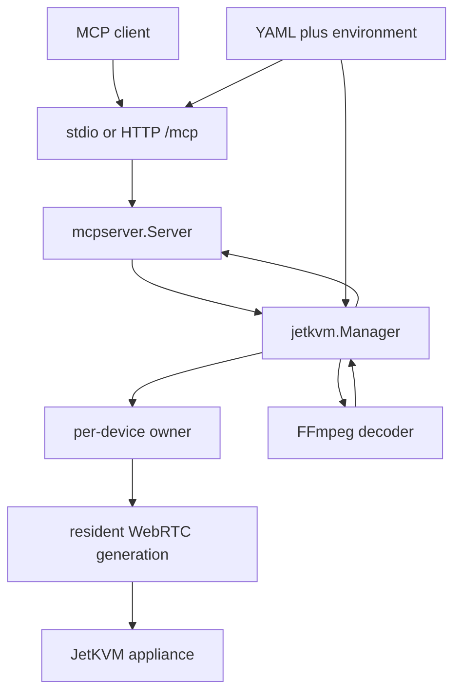

# JetKVM MCP Architecture

`cmd/jetkvm-mcp/main.go` composes a single Go process around strict YAML configuration, a `jetkvm.Manager`, a WebRTC connector, an FFmpeg PNG decoder, and `mcpserver.Server`. `Manager` constructs one `deviceOwner` for each configured device; an owner lazily opens and reuses a resident authenticated WebRTC session generation while there is demand, then closes it after the configured idle lease. The process exposes the same 19-tool MCP server either on stdio or at stateless Streamable HTTP `/mcp`; it does not expose legacy SSE.

This diagram shows the process boundary and the owner that mediates each configured appliance.

This shows the request composition boundary: the MCP layer owns schemas and result envelopes; `Manager` owns device selection and process-wide admission; a per-device owner owns session generation, reuse, idle cleanup, and scheduling; the provider owns connection mechanics; FFmpeg is only needed for screenshots.

## Startup and ownership

`run` parses the serve, `config validate`, `debug rpc`, version, and help modes. `config.Load` resolves referenced environment values and constructs `jetkvm.DeviceConfig` values. Serve mode then verifies FFmpeg by constructing `NewFFmpegDecoder`, constructs the manager with configured limits, creates a telemetry recorder on stderr, and invokes either `Server.Run` over `mcp.IOTransport` or `serveHTTP`.

The topology keeps ownership isolated per configured device rather than sharing a process-wide appliance connection. A healthy generation can serve multiple operations and is closed when the owner becomes idle, the generation ends, an explicit release succeeds, a peer takeover is recognized, or shutdown occurs. `jetkvm_release_session` yields only this process's local session resources so another authenticated operator can connect. Conversely, the destructive `jetkvm_take_over_session` validates a healthy generation or acquires one from idle, released, taken-over, or recoverable uncertain ownership; it can immediately displace an external authenticated operator and never replays prior work. Authentication cookies and WebRTC resources remain generation-scoped, while each dispatched worker keeps its own cancellation context. Read [session lifecycle](../runtime/sessions-and-device-protocol.md) for the owner state machine and connection sequence; [public surface](../mcp/public-surface.md) dispatches handlers through that boundary.

## Boundaries and non-goals

* The process accepts MCP requests; it does not implement user authorization for tools. Tool annotations are hints, not policy.
* The appliance executes HID, power, virtual-media, and remote URL fetch effects. A completed RPC is acknowledgement, not independent proof of host state.
* `/healthz` only means config and FFmpeg validation succeeded and the HTTP process accepts requests; it does not probe devices.
* Appliance sessions bypass proxy environment variables. They use a fresh cookie jar and a TLS policy configured per device.

## Change navigation

| Intent | Owns the behavior | Focused evidence |
| --- | --- | --- |
| Add/change a tool | `internal/mcpserver/server.go`, `controls.go`, `internal/mcpserver/testdata/tool-manifest.json` | `TestToolManifestContract` |
| Change dispatch/admission | `internal/jetkvm/manager.go`, `device_owner.go` | `admission_test.go`, `device_owner_test.go` |
| Change session ownership, release/takeover authority, idle reuse, or scheduling | `internal/jetkvm/manager.go`, `device_owner.go`, `provider.go`, `scheduling.go` | `release_session_test.go`, `takeover_session_test.go`, `session_connector_test.go`, `device_owner_test.go`, `scheduling_test.go` |
| Change appliance connection | `internal/jetkvm/provider.go`, `auth.go`, `signaling.go`, `rpc_session.go` | `session_test.go`, `session_protocol_test.go` |
| Change service lifecycle | `cmd/jetkvm-mcp/main.go` | `main_test.go`, HTTP and stdio integration tests |

Use `go test ./cmd/jetkvm-mcp ./internal/mcpserver ./internal/jetkvm` for an affected path; use `make protocol-gates` when MCP interoperability changes.
