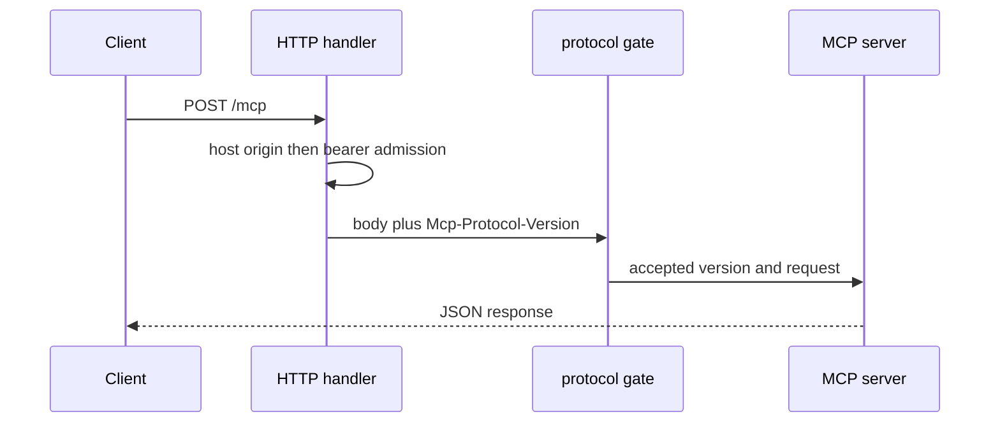

# MCP Transports and Compatibility

The product supports exactly MCP protocol version `2026-07-28`. `SupportedProtocolVersion` in `internal/mcpserver/protocol_version.go` wraps SDK transports so SDK support cannot silently widen the product promise. `server/discover` is rewritten to advertise only that revision.



This is the HTTP order after routing: host/origin admission happens before bearer authentication; the protocol gate then requires the header and matching request metadata. A rejected valid JSON-RPC request receives an unsupported-version JSON-RPC error in HTTP 400. Invalid JSON with a wrong header is HTTP 400. Stdio checks `initialize` and request `_meta` protocol version through the wrapped connection.

## Transport behavior

**stdio** uses `mcp.IOTransport`. stdout is reserved for MCP frames; startup notices and telemetry use stderr. EOF is normal server termination.

**HTTP** is `/mcp`, POST-only, stateless, JSON response mode, with a 1 MiB request limit. `/healthz` is GET-only and returns exactly `ok\n`; it bypasses MCP auth/origin checks and is liveness only. No SSE endpoint exists. `serveHTTP` gives headers five seconds, the body 15 seconds, and idle connections 60 seconds. It starts a five-second `http.Server.Shutdown` drain after SIGINT/SIGTERM; active request contexts are canceled from the process base context.

`bodyReadDeadline` wraps each request body after header admission. It clears the independent 15-second read deadline only after the declared body is fully consumed or EOF is seen. A body read error or an incompletely consumed body marks `request.Close`, sets `Connection: close`, and installs an immediate read deadline, so an unsafe partially read connection cannot be reused. The protocol gate separately reads `/mcp` through `http.MaxBytesReader` before replacing the body with a bounded in-memory reader for the SDK.

HTTP admission uses exact public host/origin policy in `trustedHostAndOrigin`: loopback/localhost hosts are trusted, otherwise a configured effective origin must match Host. A present single `Origin` must match scheme and authority; invalid/foreign/duplicate/opaque origins are forbidden before bearer checking. `requireBearer` then parses a single Bearer credential and compares SHA-256 digests with constant-time comparison. The server deliberately emits no CORS headers; allowed same-origin `OPTIONS` reaches POST-only behavior and returns 405.

## Failure and parity guarantees

`PropagateRequestCancellation` connects client cancellation to tool work. A canceled or interrupted mutation remains non-retryable and can be `outcome: unknown`; inspect actual host/device state. Read-only cancellation/timeout can be retryable. `protocol_version_test.go`, `transport_test.go`, `origin_test.go`, `cancellation_test.go`, plus the three-path manifest contract prove this behavior. Run:

```sh
go test ./internal/mcpserver ./cmd/jetkvm-mcp
make protocol-gates
```

The latter runs pinned official conformance scenarios and Inspector checks, then compares canonical read-only results between stdio and HTTP.
