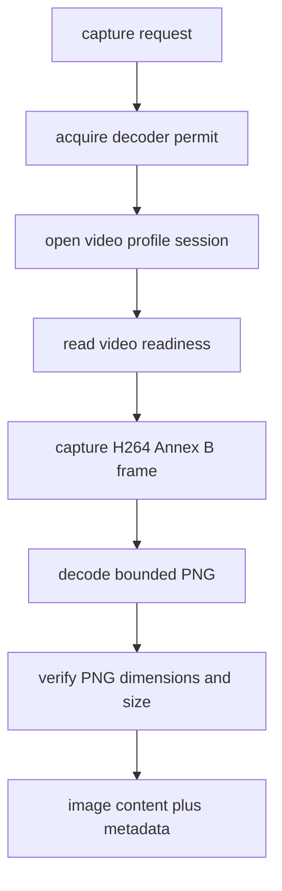

# Host Control and Screen Capture

The manager splits control into status reads, seven named power/wake actions, keyboard/mouse HID, and screen capture. All dispatch through the managed per-device owner described in [sessions and device protocol](sessions-and-device-protocol.md), so related work can reuse one healthy resident generation while preserving the owner scheduler's ordering rules.

## Status and physical controls

`Manager.Status` makes `ping` mandatory, then asks for versions, active extension, media, video, USB, and extension-specific ATX/DC state. Individual optional probe failures append a fixed warning rather than discarding an otherwise connected status. Public status deliberately projects virtual media and does not expose firmware-private URL/path fields.

Power maps names to appliance calls: ATX short/long/reset use `setATXPowerAction`; DC uses `setDCPowerState`; USB wake uses `wakeHost`; LAN wake uses configured MAC/broadcast data in `sendWOLMagicPacket`. A `completed` result means that RPC returned, not that a host booted, shut down, or woke. `force_host_power_off`, reset, DC-off, mouse clicks, and typed commands can interrupt work or cause loss.

## HID sequencing

`Keyboard` turns each permitted ASCII byte or named key into USB usage reports. For each press it sends `keyboardReport` then a zero-key release. If a press was sent and a later step fails, outcome becomes unknown; deferred best-effort release gets a separate two-second background context. `Mouse` maps absolute, relative, click, and scroll to appliance reports; clicks are press then release and receive the same unknown-after-prior-dispatch treatment.

Inputs are checked at schema and handler layers: text is 1–4096 US-ASCII bytes; named key input is bounded; modifiers are unique `ctrl`, `alt`, `shift`, `meta`; absolute coordinates are 0–32767; relative/wheel movements are -128–127; scroll cannot be zero on both axes.

## Capture lifecycle

This flow shows the bounded screenshot path after managed-session scheduling admits capture work.

Capture has a 30-second end-to-end timeout in both MCP middleware and manager logic. Defaults are 1920x1080, caller bounds are maximum 3840x2160, and accepted PNG bytes cannot exceed 32 MiB. Video not ready yields `no_signal`; missing decoder/video setup yields an appropriate read failure. Frame acquisition is serialized within a generation, and the completed H264 frame is copied before decoding so FFmpeg may continue after an idle lease closes that generation. The PNG is held transiently, verified with `png.DecodeConfig`, and is not written to disk. The MCP layer returns image bytes once as image content plus separate metadata (`device`, timestamp, MIME type, dimensions, byte count).

Run `go test ./internal/jetkvm ./internal/mcpserver` after changes. High-value suites include `controls_test.go`, `controls_manager_test.go`, `capture_test.go`, `video_test.go`, `video_fuzz_test.go`, `decoder_test.go`, and `typed_results_test.go`.
