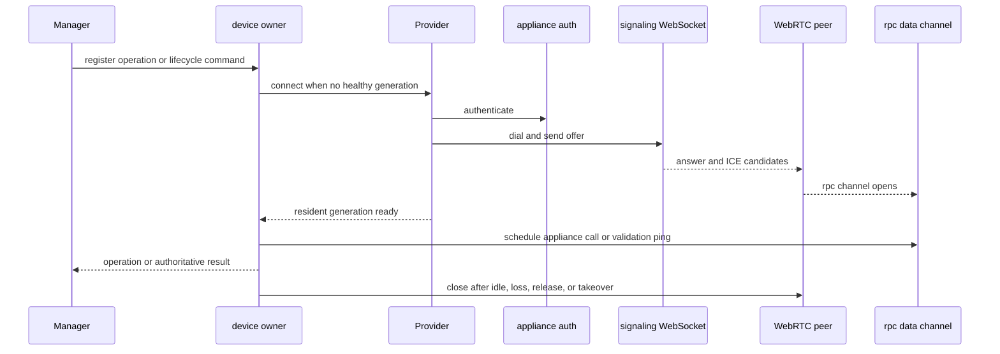

# Sessions, Admission, and Device Protocol

`jetkvm.Manager` is the sole MCP device implementation. It looks up a configured device, admits work, and maps public actions to private appliance calls. On construction it creates one `deviceOwner` per device. The owner serializes mutation/HID work, lazily creates a resident `ConnectedSession` generation, shares it across queued demand, and closes it after idle expiry, terminal loss, explicit release, recognized external takeover, or manager shutdown. `WebRTCConnector.Connect` owns the mechanics of creating one generation.

This sequence shows lazy generation setup, reuse and validation through the owner, and eventual close.

The provider uses a new cookie jar, a cloned HTTP transport with `Proxy=nil`, TLS 1.2 minimum, and `InsecureSkipVerify` only when configured. It authenticates, converts appliance HTTP(S) base URL to WS(S) signaling, creates a WebRTC data channel named `rpc`, sends an offer, pumps signaling, and waits for the data channel to open. It always creates the video-capable profile, which accepts exactly an H264 video track with 90 kHz clock and packetization mode 1. Connection and RPC request defaults are 15 seconds and 10 seconds. Close cancels the internal context, closes RPC/signaling/peer/idle HTTP connections, closes video, and waits for pumps until its caller context ends.

## Ownership, admission, and ordering

`deviceOwner` is a command-loop state machine. Demand can share an in-flight setup attempt and, after readiness ping, a healthy resident generation. It starts the idle timer only when no workers, queue entries, or demand remain. Idle expiry cancels and closes that generation; an ended generation also triggers cleanup. A cleanup failure is latched as degraded and ordinary work returns `busy` rather than reconnecting over an incomplete close. `Manager.Close` stops every owner and waits through its shutdown budget. `TestDeviceOwnerPingValidatesAndReusesResidentGeneration`, `TestDeviceOwnerIdleLeaseStartsAfterWorkAndReleasesGeneration`, and `TestDeviceOwnerDoesNotReconnectAfterIncompleteIdleCleanup` are the closest lifecycle evidence.

### Explicit release and authoritative takeover

`Manager.ReleaseSession` implements [`jetkvm_release_session`](../mcp/public-surface.md). It first takes a per-device lifecycle admission latch, so it fails immediately with `busy/not_sent` if ordinary device work is admitted; it also requires a global operation permit. The owner rejects queued, active, connecting, or cleanly-closing work. From an idle, taken-over, or uncertain owner it records `released` without reconnecting; from an active generation it closes and joins the generation before reporting `status: released`. Repeating a completed release is idempotent.

`Manager.TakeOverSession` implements [`jetkvm_take_over_session`](../mcp/public-surface.md) through the same latch and global permit, so lifecycle operations conflict rather than queue. From idle or released ownership it creates and readiness-pings a generation; from taken-over or recoverable uncertain ownership it completes cleanup before replacement setup; from an active generation it performs a validation ping without replacing it. A successful call reports `status: authoritative`. It may immediately displace an external authenticated operator, is non-idempotent, and must never be used to replay a prior operation. If setup or cleanup leaves ownership uncertain, the operation fails as `ownership_uncertain/failed` and must not open a replacement connection.

Release and takeover change local session authority, not appliance or attached-host state. Release is sticky: ordinary work does not reconnect a released or externally taken-over owner. A recognized takeover cancels the connected session, prevents new owner dispatch before terminal processing, and suppresses HID neutralization; only explicit takeover restores authority. Preserve the order **latch -> drain or validate/acquire -> result**, and do not relax fail-fast admission. `release_session_test.go` provides the release matrix. `takeover_session_test.go` proves acquisition/reuse, cleanup-before-replacement, uncertainty, lifecycle conflict, and released reacquisition; `session_connector_test.go` proves takeover latching, no ordinary reconnect, dispatch fencing, and ownership-sensitive terminal outcomes.

Default `Limits` are 16 total operations, 4 per device, 8 **connection attempts**, 2 captures, 2 decoders, and a 60-second session idle lease. Global, per-device, connection-attempt, capture, and decoder permits are non-blocking: exhausted capacity returns `busy` with `not_sent`, not a queue. A healthy resident generation does not consume a connection-attempt permit. Mutation/HID sequencing is different: the owner uses a cancellable FIFO gate that waits while the caller context is live. Thus unrelated devices and ordinary reads can progress, while HID, power, and virtual-media mutations for one device are serialized.

Within a generation, ordinary RPCs use a fair RPC gate. The current capability profile permits a read RPC to interleave between mutation RPC calls and permits a read RPC while capture is acquiring a frame; a session-wide fallback blocks those overlaps. Capture serializes frame acquisition, copies a completed frame before decoding, and may release the generation lease while decoding proceeds. Keep these deliberately narrow concurrency guarantees when changing scheduling: `TestInitialCapabilityProfileInterleavesReadAtMutationRPCBoundary`, `TestInitialCapabilityProfileOverlapsOneRPCWithFrameAcquisition`, `TestSessionWideFallbackDoesNotOverlapRPCAndFrameAcquisition`, and `TestCaptureReleasesGenerationLeaseAfterImmutableFrameCopy` cover them.

`Status` first requires `ping == "pong"`, then performs best-effort probes; failed optional probes become warnings unless context cancellation/deadline requires termination. Each power action maps to one appliance RPC in `powerRequest`. Unknown device/target and invalid local preparation fail before session creation.

## Failure taxonomy

`internal/jetkvm/errors.go` classifies transport/protocol/auth/video and session-authority failures into `OperationError` codes and outcomes. `mcpserver.toolFailure` emits the stable JSON envelope `{version, code, message, outcome, retryable}`. The accepted public codes are `operation_failed`, `canceled`, `timeout`, `invalid_input`, `busy`, `session_released`, `session_taken_over`, `ownership_uncertain`, `authentication_failed`, `device_unavailable`, `video_unavailable`, `no_signal`, and `protocol_error`; outcomes are only `not_sent`, `failed`, or `unknown`.

Validation, unknown device/target, capacity, and cancellation before session callback are `not_sent`. A failure before RPC dispatch is likewise `not_sent`; write failure, timeout, cancellation, or an unconfirmed response after a mutation can be `unknown`, while a confirmed appliance RPC error can be `failed`. `classifyReadFailure` uses `failed`, and read `canceled`, `timeout`, `device_unavailable`, or `no_signal` is retryable unless already `not_sent`. Mutation failures are always non-retryable; absent reliable classification also defaults them to `unknown`. This distinction is the operational invariant, not a suggestion to re-run mutations.

## Change navigation

When changing ownership or scheduling, start in `internal/jetkvm/device_owner.go` and `scheduling.go`, then trace `Manager.withOperation`, `Manager.ReleaseSession`, and `Manager.TakeOverSession` in `manager.go`. Preserve: no connection attempt after all setup waiters leave; no replacement connection after incomplete cleanup; release remains fail-fast against admitted work and does not report completion before active resources close; takeover validates a healthy generation or waits for automatic sticky cleanup before replacement; recognized external takeover fences new dispatch and ordinary reconnect; cancellation before dispatch is `not_sent`; and stale completions cannot alter a replacement generation. `device_owner_test.go` names ordinary lifecycle cases, `release_session_test.go` owns explicit release, `takeover_session_test.go` and `session_connector_test.go` own authority transitions, and `scheduling_test.go` covers interleaving, cancellation, capture frame ownership, and HID cleanup suppression. Run `go test ./internal/jetkvm`; add `make race` when changing owner, scheduler, decoder, or video concurrency.

Test ownership also includes `manager_test.go`, `admission_test.go`, `provider_test.go`, `session_test.go`, `session_protocol_test.go`, `auth_test.go`, and signaling/RPC fuzz tests. The appliance compatibility evidence and drift process are documented in [JetKVM compatibility](../integrations/jetkvm-compatibility.md); the [control and capture guide](control-and-capture.md) consumes these scheduling rules for HID and screenshots.
