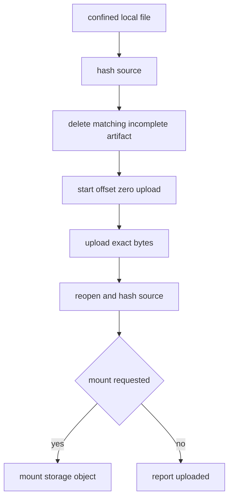

# Virtual Media Authorization and Integrity

`Manager.VirtualMedia` implements five public actions behind dedicated MCP tools: status, URL mount, local-file mount, unmount, and upload without mount. It runs as a mutation except status, so all virtual-media mutation work is serialized per device.

## URL mount

A URL mount requires a non-empty per-device `MediaURLAllowedOrigins`. `parseAllowedMediaURL` accepts only HTTP(S), no credentials, and an exact effective scheme/host/port match. It compares host and scheme case-insensitively and treats explicit default ports as equivalent. The full URL may retain path/query/fragment after its origin is authorized. Empty or unmatched policy, malformed URL, credentials, and unsupported scheme are rejected before a provider/session call as `not_sent`.

This authorizes the requested origin only. The JetKVM firmware performs the fetch, so this process does not resolve/pin DNS, inspect redirects, classify the final IP, or control the appliance network. Keep appliance egress segmented.

## Local upload and mount

A local source must be a relative non-empty path resolving below absolute `media_directory`; absolute and traversal paths are rejected. `openMediaFile` opens through `os.OpenRoot`, requires a regular non-empty file no larger than 64 GiB, and projects only `filepath.Base(clean)` to the appliance. No root means local actions are unavailable. Before upload the manager hashes the confined source, lists storage, deletes a matching `.incomplete` appliance artifact, calls `startStorageFileUpload` with filename and size, and accepts only `alreadyUploadedBytes == 0` plus an `upload_` UUID-shaped channel ID. It streams exactly the original size through a SHA-256 tee, compares that digest to the initial digest, then reopens, stats, and hashes the configured path again before reporting upload or issuing `mountWithStorage`. This intentionally refuses firmware partial-resume offsets: firmware has only byte count, not a prefix hash, so resuming could combine stale remote bytes with a replaced local file.

The returned public result uses source type `storage`, never the local filename. Unmount is allowed even when nothing is mounted. Status reads and projects only mounted/source class/mode, rejecting unknown firmware source or mode rather than leaking raw state.

## Mutation uncertainty

Local parsing, file access, allowlist denial, and pre-session connection errors are `not_sent`. Once cleanup, upload, mount, or an earlier sequence step may have reached the appliance, later errors are `unknown`; do not blindly retry. On failed upload, changed source, invalid negotiation, or failed mount, cleanup attempts to delete both `<filename>.incomplete` and `<filename>`. Cleanup deliberately uses a detached context (`context.WithoutCancel`) capped at two seconds, so it can attempt appliance cleanup even after the caller canceled; cleanup is best effort and cannot convert an uncertain mutation into a safe retry. Inspect `jetkvm_get_virtual_media_status` and appliance state first.

The implementation is `internal/jetkvm/virtual_media.go`; test `virtual_media_test.go` covers allowlists, no-session rejection, privacy, cleanup, sequence uncertainty, file upload/mount, and source changes. `virtual_media_fuzz_test.go` exercises parser boundaries. Configuration ownership is [configuration and security](../security/configuration.md).
